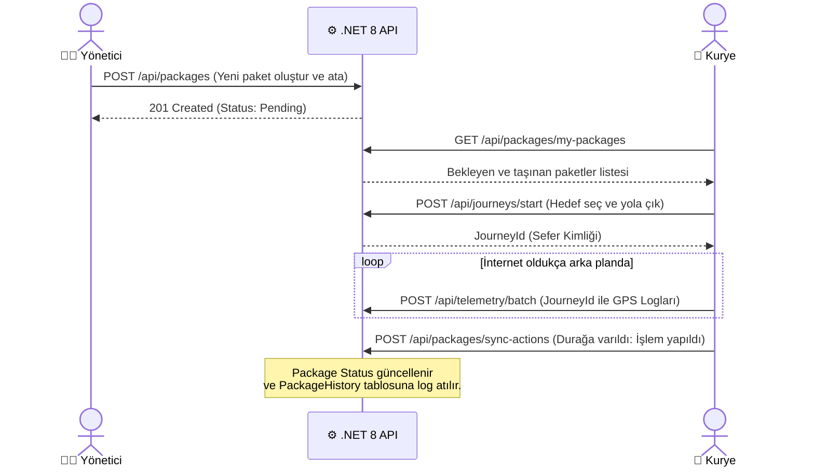
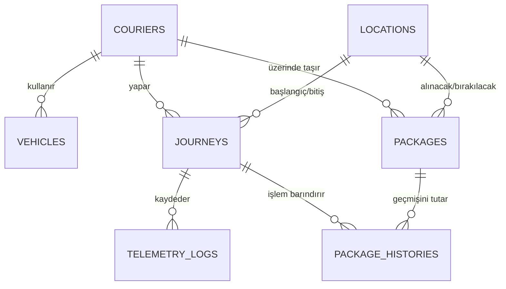

# 📋 Tıbbi Lojistik - Backend API Spesifikasyonları (Sina ➔ Enes)

> [!NOTE]
> **Proje Amacı:** Tıbbi ürünlerin (Kan örneği, organ vb.) hastaneler arası transferini %100 doğrulukla ve kanuni gözetim zincirine (Chain of Custody) uygun şekilde loglayarak takip etmektir.
> **Teknoloji Yığını:** .NET 8 ASP.NET Core Web API, PostgreSQL, Entity Framework Core (Code-First Migration), NLog.
> **Mimari:** Tek `.csproj` (Monolithic), katmanlara boğulmadan doğrudan işlevsel servisler.

---

## 1. İş Akışı ve Yaşam Döngüsü

Aşağıdaki şema, sistemin uçtan uca nasıl çalışması gerektiğini ve API uçlarının ne zaman çağrılacağını göstermektedir:



---

## 2. Veritabanı Mimarisi (EF Core Entity İlişkileri)

Tıbbi lojistikte veri kaybı kabul edilemez. Kuryenin o an nerede olduğu, hangi paketin hangi fiziksel seferde taşındığı birbiriyle sıkıca bağlı olmalıdır.



### Tablo Yapıları (`DbSet`)

| Tablo Adı | Birincil Anahtar | Önemli Kolonlar ve Türleri | Yabancı Anahtarlar (Foreign Keys) |
| :--- | :--- | :--- | :--- |
| **`Admins`** | `Id` (Guid/Int) | `Name` (string), `Phone` (string) | Yok |
| **`Couriers`** | `Id` | `Name` (string), `Phone` (string), `IsActive` (bool), `LastLat` (double), `LastLng` (double) | `ActiveVehicleId` ➔ `Vehicles` |
| **`Vehicles`** | `Id` | `PlateNumber` (string), `VehicleType` (string) | `CourierId` ➔ `Couriers` |
| **`Locations`** | `Id` | `Name` (string), `Latitude` (double), `Longitude` (double) | Yok |
| **`Journeys`** | `Id` | `StartTime` (DateTime), `EndTime` (DateTime?), `Status` (Enum) | `CourierId` ➔ `Couriers`<br>`StartLocId`, `EndLocId` ➔ `Locations` |
| **`Packages`** | `Id` | `Barcode` (string?), `Description` (string), `Priority` (short), `Status` (Enum) | `PickupLocId`, `DropoffLocId` ➔ `Locations`<br>`AssignedCourierId` ➔ `Couriers` |
| **`PackageHistories`**| `Id` | `ActionType` (Enum), `ActionTime` (DateTime), `Notes` (string?) | `PackageId` ➔ `Packages`<br>`JourneyId` ➔ `Journeys` |
| **`TelemetryLogs`** | `Id` | `Latitude` (double), `Longitude` (double), `Timestamp` (DateTime) | `JourneyId` ➔ `Journeys` |

> [!WARNING]
> **Kritik Kural:** `PackageHistories` tablosu asla silinmemelidir (Soft-delete bile yapılmamalı). Paketin her hareketi kanunlar gereği kalıcı loglanmalıdır.

---

## 3. API Sözleşmesi (Endpoint Tasarımları)

Frontend ile Backend'in konuşacağı kesin JSON formatları aşağıdadır.

### 📍 1. Konum (Lokasyon) Çekme
Sistemdeki tüm tanımlı durakları (Hastane/Lab) getirir.
- **GET** `/api/locations`
- **Beklenen Cevap (200 OK):**
```json
[
  { "id": 1, "name": "AYBÜ Kampüs", "lat": 40.2316, "lng": 33.0225 },
  { "id": 2, "name": "Medipol Laboratuvarı", "lat": 39.9208, "lng": 32.8541 }
]
```

### 📦 2. Yönetici - Yeni Paket Atama
- **POST** `/api/packages`
- **Gönderilen (Payload):**
```json
{
  "barcode": "HAST-1234", 
  "description": "Acil Kan Örneği",
  "priority": 10, 
  "pickupLocationId": 1,
  "dropoffLocationId": 2,
  "assignedCourierId": 5
}
```
- **Beklenen Cevap (201 Created):** İşlem başarılı olduğunda `PackageHistories` tablosuna *"Oluşturuldu"* logu atılmalıdır.

### 🎒 3. Kurye - Bekleyen ve Taşınan Paketler
Kurye sisteme girdiğinde sadece kendisini ilgilendiren işleri alır.
- **GET** `/api/packages/my-packages?courierId=5`
- **Beklenen Cevap (200 OK):**
```json
[
  {
    "id": 105,
    "description": "Acil Kan Örneği",
    "status": "Pending",
    "pickupLocationId": 1,
    "dropoffLocationId": 2
  }
]
```

### 🏍️ 4. Yolculuk (Journey) Başlatma
Kurye rotasını seçip Yola Çık butonuna bastığında çağrılır.
- **POST** `/api/journeys/start`
- **Gönderilen (Payload):** `{"courierId": 5, "startLocationId": 1, "endLocationId": 2}`
- **Beklenen Cevap (201 Created):** `{"journeyId": 99}`

### 🔄 5. Çevrimdışı (Offline) Uyumlu Eylem Senkronizasyonu
Kurye internetin çekmediği bir bodrum katında barkod okutursa (Teslim alma/etme), cihaz internete bağlandığı an bu veriler toplu olarak gönderilir.
- **POST** `/api/packages/sync-actions`
- **Gönderilen (Payload):**
```json
{
  "courierId": 5,
  "journeyId": 99,
  "actions": [
    {
      "packageId": 105,
      "actionType": "PickedUp", 
      "actionTime": "2026-07-22T08:00:00Z",
      "notes": "Bodrum kat labdan teslim alındı."
    }
  ]
}
```
- **Beklenen Cevap (200 OK):** Sistem bu paketin ana tablodaki `Status` değerini güncellemeli ve `PackageHistories` tablosuna bu eylemi kaydetmelidir.

### 📡 6. Telemetri (GPS Logları)
Kuryenin yoldayken ürettiği anlık veriler, belirlenen Event (Olay) standartlarına göre toplu olarak sunucuya itilir.
- **POST** `/api/telemetry/batch`
- **Gönderilen (Payload):**
```json
{
  "event_name": "DELIVERY_ROUTE_UPDATE",
  "timestamp": "2026-07-22T08:10:05.000Z",
  "context": {
    "courier_id": 5,
    "journey_id": 99,
    "session_id": "a1c6be91-5916-4126-9fac-e0f0a61dd4b7"
  },
  "payload": {
    "actual_path_segment": [
      {
        "lat": 39.92086, 
        "lng": 32.854104, 
        "timestamp": "2026-07-22T08:10:00Z"
      },
      {
        "lat": 39.920869, 
        "lng": 32.853909, 
        "timestamp": "2026-07-22T08:11:00Z"
      }
    ]
  }
}
```
- **Beklenen Cevap (200 OK):** Bu veriler veritabanındaki `TelemetryLogs` tablosuna ilgili `journeyId` ile yazılır. Yöneticinin Canlı Haritası (Admin Dashboard) da kuryenin son konumunu `LastLat/LastLng` üzerinden bu sayede günceller.
